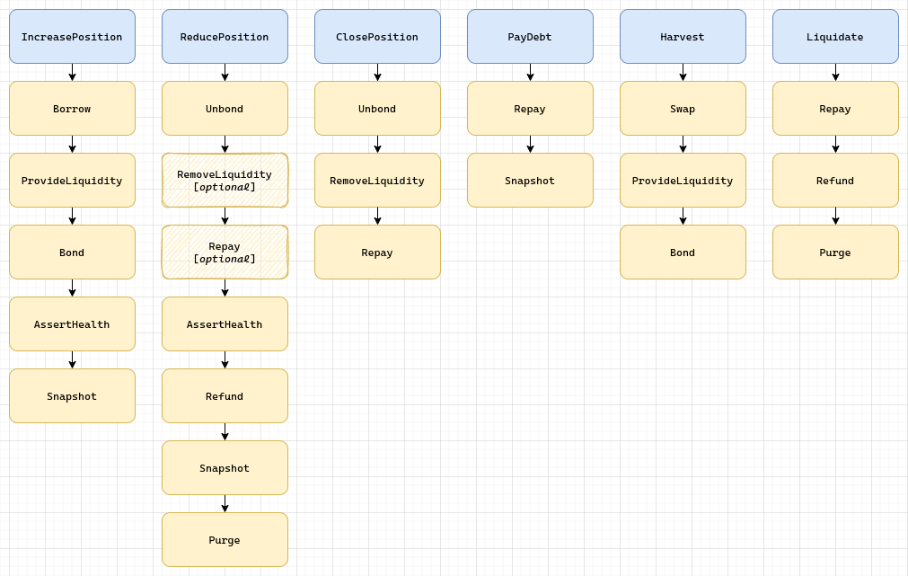

# Martian Field

Martian Field is a leveraged yield farming strategy utilizing liquidity from [Mars Protocol](https://twitter.com/mars_protocol).

## Overview

Users may deposit one of the following assets:

- ANC
- MIR
- MINE
- MARS
- ASTRO

The strategy borrows UST as uncollateralized loans from Mars, and provides the assets to an AMM pool (TerraSwap or Astroport). The acquired share tokens are then bonded to the respective protocol's staking contract. Staking rewards are claimed and reinvested on a regular basis.

The strategy also tracks each user's loan-to-value ratio (LTV). If a user's LTV exceeds a preset threshold, typically as a result of the asset's price falling or debt builds up too quickly, the position is subject to liquidation.

## Contract Design

### Handle Messages

| Message                       | Description                                                                                         |
| ----------------------------- | --------------------------------------------------------------------------------------------------- |
| `HandleMsg::IncreasePosition` | Open a new position or add to an existing position                                                  |
| `HandleMsg::ReducePosition`   | Reduce a position, or close it completely                                                           |
| `HandleMsg::ClosePosition`    | Close an underfunded position in preparation for liquidation                                        |
| `HandleMsg::PayDebt`          | Pay down debt owed to Mars, reduce debt units threshold                                             |
| `HandleMsg::Harvest`          | Claim staking rewards and reinvest                                                                  |
| `HandleMsg::Liquidate`        | Pay down the remaining debt of a closed position and be rewarded by part of its unlocked collateral |
| `HandleMsg::UpdateConfig`     | Update data stored in config (owner only)                                                           |

### Query Messages

| Message              | Description                                                                        |
| -------------------- | ---------------------------------------------------------------------------------- |
| `QueryMsg::Config`   | Returns the config info                                                            |
| `QueryMsg::State`    | Returns the contract's global state                                                |
| `QueryMsg::Position` | Returns info of an individual position                                             |
| `QueryMsg::Health`   | Returns health factor of an individual position                                    |
| `QueryMsg::Snapshot` | Returns a historical snapshot of a position, used by the frontend to calculate PnL |

### Callback Messages

Martian Field makes extensive use of [CosmWasm's callback pattern](https://github.com/CosmWasm/cosmwasm-plus/blob/main/PATTERNS.md#callbacks). Each callback is a portable building block that can be combined to in the execution of complex tasks, illustrated as follows:



## Development

### Dependencies

- Rust v1.44.1+
- `wasm32-unknown-unknown` target
- Docker
- [LocalTerra](https://github.com/terra-project/LocalTerra)
- Node.js v16

### Envrionment Setup

1. Install `rustup` via https://rustup.rs/

2. Add `wasm32-unknown-unknown` target

```sh
rustup default stable
rustup target add wasm32-unknown-unknown
```

3. Install [Docker](https://www.docker.com/)

4. Clone the [LocalTerra](https://github.com/terra-project/LocalTerra#usage) repository, edit `config/genesis.json` as follows. This fixes the rate of stability fee (aka "tax") charged on UST transfers to the value of 0.1%, which gives us deterministic and preditable results.

```diff
"app_state": {
  "treasury": {
    "params": {
      "tax_policy": {
-       "rate_min": "0.000500000000000000",
-       "rate_max": "0.010000000000000000",
+       "rate_min": "0.001000000000000000",
+       "rate_max": "0.001000000000000000",
      },
-     "change_rate_max": "0.000250000000000000"
+     "change_rate_max": "0.000000000000000000"
    }
  }
}
```

5. Optionally, [speed up LocalTerra's blocktime](https://github.com/terra-project/LocalTerra#pro-tip-speed-up-block-time) by changing `config/config.toml` as follows:

```diff
##### consensus configuration options #####
[consensus]

wal_file = "data/cs.wal/wal"
- timeout_propose = "3s"
- timeout_propose_delta = "500ms"
- timeout_prevote = "1s"
- timeout_prevote_delta = "500ms"
- timeout_precommit_delta = "500ms"
- timeout_commit = "5s"
+ timeout_propose = "200ms"
+ timeout_propose_delta = "200ms"
+ timeout_prevote = "200ms"
+ timeout_prevote_delta = "200ms"
+ timeout_precommit_delta = "200ms"
+ timeout_commit = "200ms"
```

6. Install Node, preferrably using [nvm](https://github.com/nvm-sh/nvm#installing-and-updating), as well as libraries required for testing:

```bash
nvm install 16
nvm alias default 16
cd fields-of-mars/scripts
npm install
```

### Compile

Make sure the current working directory is set to the root directory of this repository, then

```bash
docker run --rm -v "$(pwd)":/code \
  --mount type=volume,source="$(basename "$(pwd)")_cache",target=/code/target \
  --mount type=volume,source=registry_cache,target=/usr/local/cargo/registry \
  cosmwasm/workspace-optimizer:0.11.4
```

### Test

Start LocalTerra:

```bash
cd /path/to/LocalTerra
git checkout main  # main branch for columbus-5 envrionment
git pull
docker-compose up
```

Run test scripts: inside `scripts` folder,

```bash
ts-node 1_terraswap_token.spec.ts
ts-node 2_terraswap_pair.spec.ts
ts-node 3_mock_mars.spec.ts
ts-node 4_mock_anchor.spec.ts
ts-node 5_mock_mirror.spec.ts
ts-node 6_martian_field.spec.ts
```

### Deploy

Provide seed phrases in `scripts/.env` file, then:

```bash
ts-node deploy.ts --network {columbus|bombay} --strategy {anchor|mirror} [--code-id <codeId>]
```

### Notes

- LocalTerra [only works on X86 processors](https://github.com/terra-project/LocalTerra#requirements). There is currently no way to run the tests on Macs with the M1 processor.

- VS Code users are recommended to install `rust-lang.rust` and `esbenp.prettier-vscode` plugins, and open the workspace from `field-of-mars.code-workspace` included in the base directory of this repo, which contains some helpful configurations.

## Deployment

### Columbus-5

| Contract                   | Address                                                                                                                                      |
| -------------------------- | -------------------------------------------------------------------------------------------------------------------------------------------- |
| Anchor Token               | [`terra14z56l0fp2lsf86zy3hty2z47ezkhnthtr9yq76`](https://finder.terra.money/columbus-4/address/terra14z56l0fp2lsf86zy3hty2z47ezkhnthtr9yq76) |
| Anchor Staking             | [`terra1897an2xux840p9lrh6py3ryankc6mspw49xse3`](https://finder.terra.money/columbus-4/address/terra1897an2xux840p9lrh6py3ryankc6mspw49xse3) |
| TerraSwap ANC-UST Pair     | [`terra1gm5p3ner9x9xpwugn9sp6gvhd0lwrtkyrecdn3`](https://finder.terra.money/columbus-4/address/terra1gm5p3ner9x9xpwugn9sp6gvhd0lwrtkyrecdn3) |
| TerraSwap ANC-UST LP Token | [`terra1gecs98vcuktyfkrve9czrpgtg0m3aq586x6gzm`](https://finder.terra.money/columbus-4/address/terra1gecs98vcuktyfkrve9czrpgtg0m3aq586x6gzm) |
| Mirror Token               | [`terra15gwkyepfc6xgca5t5zefzwy42uts8l2m4g40k6`](https://finder.terra.money/columbus-4/address/terra15gwkyepfc6xgca5t5zefzwy42uts8l2m4g40k6) |
| Mirror Staking             | [`terra17f7zu97865jmknk7p2glqvxzhduk78772ezac5`](https://finder.terra.money/columbus-4/address/terra17f7zu97865jmknk7p2glqvxzhduk78772ezac5) |
| TerraSwap MIR-UST Pair     | [`terra1amv303y8kzxuegvurh0gug2xe9wkgj65enq2ux`](https://finder.terra.money/columbus-4/address/terra1amv303y8kzxuegvurh0gug2xe9wkgj65enq2ux) |
| TerraSwap MIR-UST LP Token | [`terra17gjf2zehfvnyjtdgua9p9ygquk6gukxe7ucgwh`](https://finder.terra.money/columbus-4/address/terra17gjf2zehfvnyjtdgua9p9ygquk6gukxe7ucgwh) |
| Red Bank                   | TBD                                                                                                                                          |
| Martian Field: ANC-UST LP  | TBD                                                                                                                                          |
| Martian Field: MIR-UST LP  | TBD                                                                                                                                          |

### Bombay-0008

| Contract                   | Address                                                                                                                                        |
| -------------------------- | ---------------------------------------------------------------------------------------------------------------------------------------------- |
| Anchor Token               | [`terra1747mad58h0w4y589y3sk84r5efqdev9q4r02pc`](https://finder.terra.money/tequila-0004/address/terra1747mad58h0w4y589y3sk84r5efqdev9q4r02pc) |
| Anchor Staking             | [`terra19nxz35c8f7t3ghdxrxherym20tux8eccar0c3k`](https://finder.terra.money/tequila-0004/address/terra19nxz35c8f7t3ghdxrxherym20tux8eccar0c3k) |
| TerraSwap ANC-UST Pair     | [`terra1wfvczps2865j0awnurk9m04u7wdmd6qv3fdnvz`](https://finder.terra.money/tequila-0004/address/terra1wfvczps2865j0awnurk9m04u7wdmd6qv3fdnvz) |
| TerraSwap ANC-UST LP Token | [`terra1vg0qyq92ky9z9dp0j9fv5rmr2s80sg605dah6f`](https://finder.terra.money/tequila-0004/address/terra1vg0qyq92ky9z9dp0j9fv5rmr2s80sg605dah6f) |
| Mirror Token               | [`terra10llyp6v3j3her8u3ce66ragytu45kcmd9asj3u`](https://finder.terra.money/tequila-0004/address/terra10llyp6v3j3her8u3ce66ragytu45kcmd9asj3u) |
| Mirror Staking             | [`terra1a06dgl27rhujjphsn4drl242ufws267qxypptx`](https://finder.terra.money/tequila-0004/address/terra1a06dgl27rhujjphsn4drl242ufws267qxypptx) |
| TerraSwap MIR-UST Pair     | [`terra1cz6qp8lfwht83fh9xm9n94kj04qc35ulga5dl0`](https://finder.terra.money/tequila-0004/address/terra1cz6qp8lfwht83fh9xm9n94kj04qc35ulga5dl0) |
| TerraSwap MIR-UST LP Token | [`terra1zrryfhlrpg49quz37u90ck6f396l4xdjs5s08j`](https://finder.terra.money/tequila-0004/address/terra1zrryfhlrpg49quz37u90ck6f396l4xdjs5s08j) |
| Red Bank                   | [`terra1knxh6cd43jswu3ahyx2cd9mzchynmpcqzpa65x`](https://finder.terra.money/tequila-0004/address/terra1knxh6cd43jswu3ahyx2cd9mzchynmpcqzpa65x) |
| Martian Field: ANC-UST LP  | TBD                                                                                                                                            |
| Martian Field: MIR-UST LP  | TBD                                                                                                                                            |

## License

TBD
