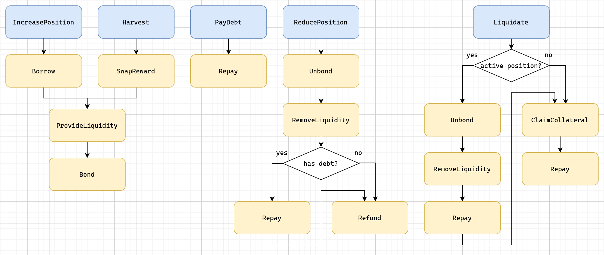

# Field of Mars: Strategy

Leveraged yield farming strategy for Mirror and Anchor protocols.

## Messages

### Overview

| Message            | Description                                                                     |
| ------------------ | ------------------------------------------------------------------------------- |
| `IncreasePosition` | Open a new position or add to an existing position                              |
| `ReducePosition`   | Reduce a position, or close it completely                                       |
| `PayDebt`          | Pay down debt owed to Mars, reduce debt units threshold                         |
| `Harvest`          | Claim staking rewards and reinvest                                              |
| `Liquidate`        | Close an underfunded position, pay down remaining debt and claim the collateral |
| `UpdateConfig`     | Update data stored in config (owner only)                                       |

### IncreasePosition

- The user must have approved the strategy to draw MIR tokens from his wallet. Typically, `Cw20HandleMsg::Approve` and this message are sent along in the same transaction.

- Any amount of UST may be sent along with the message. The strategy calculates how much UST is needed for liquidity provision; if the amount send by the user is not sufficient, borrows uncollateralized loan from Mars to make up the difference.

- The strategy does not check if there is enough UST liquidity at Mars to be borrowed, or if it has enough credit line for borrowing uncollateralized loans. The frontend should perform these checks.

### ReducePosition

- The resulting debt ratio must be less or equal than the liquidation threshold, or the transaction reverts.

- Callable only by the user himself.

### PayDebt

- Stability fee (also known as "tax") is charged twice during this function's execution: 1) during the transfer of UST from the user's wallet to the strategy, 2) from the strategy to Mars. Among these, 1) is directly deducted from the user's wallet balance, while 2) is deducted the the strategy's balance. The frontend should handle this.

- For example, if a user wishes to pay down 100 UST debt, and the tax for a 100 UST transfer is 0.1 UST, he needs to actually send 100.1 UST to the contract, of which only 100 UST will be delivered to Mars, and a total of 100.2 UST (plus gas fee) will be deducted from his account.

### Liquidate

- Callable by anyone, but only if the position's debt ratio is above the liquidation threshold.

- If the position is active (defined by `asset_units` > 0), the position will first be closed. This involves unbonding the LP tokens from Mirror Staking contract, remove liquidity from TerraSwap, use the UST proceedings to pay off the debt, and withhold the MIR proceedings pending liquidation. At this time, anyone can send along UST to pay off a portion of the remaining debt, and being awarded a portion of the withheld MIR.

### Harvest

- For now, only the owner is allowed to call this function. Later, once the strategy is proven to be stable, we will consider making this function callable by anyone.

### Callbacks

This strategy makes extensive use of [CosmWasm's callback pattern](https://github.com/CosmWasm/cosmwasm-plus/blob/main/PATTERNS.md#callbacks). Each callback message is used as a building block, and may be call in the execution of different Handle Messages.

There are total 8 callback messaegs:

- `ProvideLiquidity`
- `RemoveLiquidity`
- `Bond`
- `Unbond`
- `Borrow`
- `Repay`
- `SwapReward`
- `Refund`
- `ClaimCollateral`
- `UpdateConfig`

Diagram below shows how these callbacks are used in the execution of each Handle Message:

## Deployment

### Columbus-4

| Contract                   | Address                                                                                                                                      |
| -------------------------- | -------------------------------------------------------------------------------------------------------------------------------------------- |
| Anchor Token               | [`terra14z56l0fp2lsf86zy3hty2z47ezkhnthtr9yq76`](https://finder.terra.money/columbus-4/address/terra14z56l0fp2lsf86zy3hty2z47ezkhnthtr9yq76) |
| Anchor Staking             | [`terra1897an2xux840p9lrh6py3ryankc6mspw49xse3`](https://finder.terra.money/columbus-4/address/terra1897an2xux840p9lrh6py3ryankc6mspw49xse3) |
| TerraSwap ANC-UST Pair     | [`terra1gm5p3ner9x9xpwugn9sp6gvhd0lwrtkyrecdn3`](https://finder.terra.money/columbus-4/address/terra1gm5p3ner9x9xpwugn9sp6gvhd0lwrtkyrecdn3) |
| TerraSwap ANC-UST LP Token | [`terra1gecs98vcuktyfkrve9czrpgtg0m3aq586x6gzm`](https://finder.terra.money/columbus-4/address/terra1gecs98vcuktyfkrve9czrpgtg0m3aq586x6gzm) |
| Mirror Token               | [`terra15gwkyepfc6xgca5t5zefzwy42uts8l2m4g40k6`](https://finder.terra.money/columbus-4/address/terra15gwkyepfc6xgca5t5zefzwy42uts8l2m4g40k6) |
| Mirror Staking             | [`terra17f7zu97865jmknk7p2glqvxzhduk78772ezac5`](https://finder.terra.money/columbus-4/address/terra17f7zu97865jmknk7p2glqvxzhduk78772ezac5) |
| TerraSwap MIR-UST Pair     | [`terra1amv303y8kzxuegvurh0gug2xe9wkgj65enq2ux`](https://finder.terra.money/columbus-4/address/terra1amv303y8kzxuegvurh0gug2xe9wkgj65enq2ux) |
| TerraSwap MIR-UST LP Token | [`terra17gjf2zehfvnyjtdgua9p9ygquk6gukxe7ucgwh`](https://finder.terra.money/columbus-4/address/terra17gjf2zehfvnyjtdgua9p9ygquk6gukxe7ucgwh) |
| Field of Mars: Anchor      | TBD                                                                                                                                          |
| Field of Mars: Mirror      | TBD                                                                                                                                          |

### Tequila-004

| Contract                   | Address                                                                                                                                      |
| -------------------------- | -------------------------------------------------------------------------------------------------------------------------------------------- |
| Anchor Token               | [`terra1747mad58h0w4y589y3sk84r5efqdev9q4r02pc`](https://finder.terra.money/columbus-4/address/terra1747mad58h0w4y589y3sk84r5efqdev9q4r02pc) |
| Anchor Staking             | [`terra19nxz35c8f7t3ghdxrxherym20tux8eccar0c3k`](https://finder.terra.money/columbus-4/address/terra19nxz35c8f7t3ghdxrxherym20tux8eccar0c3k) |
| TerraSwap ANC-UST Pair     | [`terra1wfvczps2865j0awnurk9m04u7wdmd6qv3fdnvz`](https://finder.terra.money/columbus-4/address/terra1wfvczps2865j0awnurk9m04u7wdmd6qv3fdnvz) |
| TerraSwap ANC-UST LP Token | [`terra1vg0qyq92ky9z9dp0j9fv5rmr2s80sg605dah6f`](https://finder.terra.money/columbus-4/address/terra1vg0qyq92ky9z9dp0j9fv5rmr2s80sg605dah6f) |
| Mirror Token               | [`terra10llyp6v3j3her8u3ce66ragytu45kcmd9asj3u`](https://finder.terra.money/columbus-4/address/terra10llyp6v3j3her8u3ce66ragytu45kcmd9asj3u) |
| Mirror Staking             | [`terra1a06dgl27rhujjphsn4drl242ufws267qxypptx`](https://finder.terra.money/columbus-4/address/terra1a06dgl27rhujjphsn4drl242ufws267qxypptx) |
| TerraSwap MIR-UST Pair     | [`terra1cz6qp8lfwht83fh9xm9n94kj04qc35ulga5dl0`](https://finder.terra.money/columbus-4/address/terra1cz6qp8lfwht83fh9xm9n94kj04qc35ulga5dl0) |
| TerraSwap MIR-UST LP Token | [`terra1zrryfhlrpg49quz37u90ck6f396l4xdjs5s08j`](https://finder.terra.money/columbus-4/address/terra1zrryfhlrpg49quz37u90ck6f396l4xdjs5s08j) |
| Field of Mars: Anchor      | TBD                                                                                                                                          |
| Field of Mars: Mirror      | TBD                                                                                                                                          |
